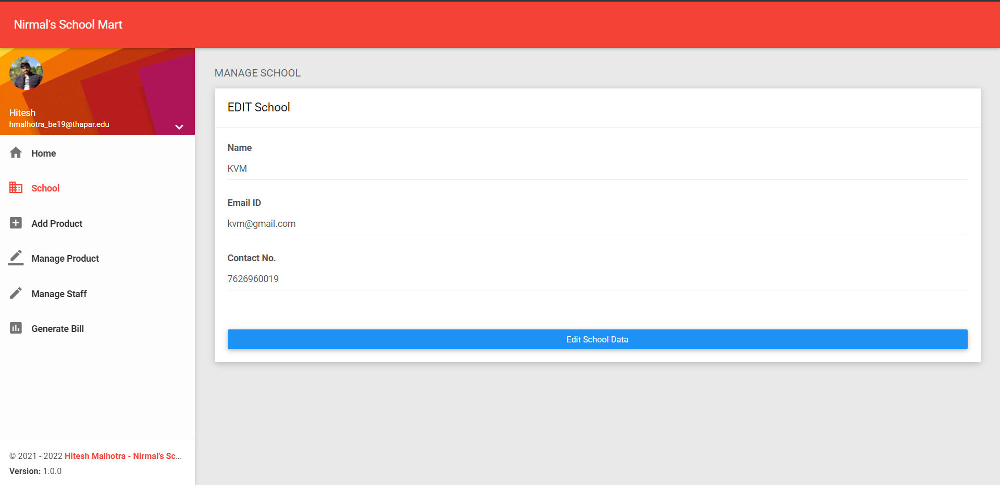
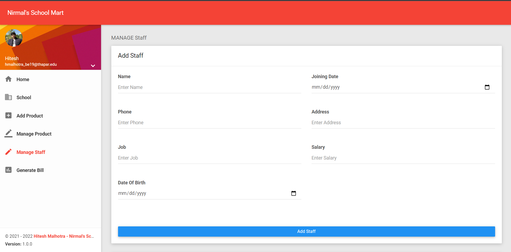

## Live Project LINK 
<a href="https://shrouded-dawn-22326.herokuapp.com/">https://shrouded-dawn-22326.herokuapp.com/</a>

## Login DETAILS
<pre>Username : admin</pre>
<pre>Password : admin12345</pre>

## ============PROJECT DETAILS=============================

## Available Scripts

Install Package by Running Command:

### `npm install`

In the project directory, you can run:

### `npm start`

### For Server Side Django Project Follow This Link.

<a href="https://github.com/CodeWithHitesh/NirmalSchoolMartApi">Nirmal School Mart API</a>

## Login Page Added.

## Dashboard Page Added.

## Add School Page Added.

## View School Page Added.

## Edit and Update School Page Added .

## Add Product Page Added .

## Edit Product Page Added .

## Added Add Staff Page

## Added Bill Generate Form

